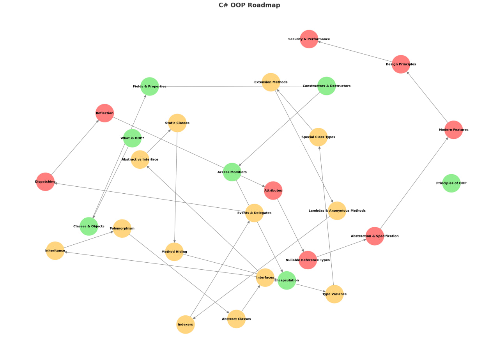

# 🚀 OOP Roadmap in C#

این مستند یک نقشه‌ی راه جامع برای یادگیری **برنامه‌نویسی شی‌گرا (OOP)** در زبان C# است.  
مطالب در سه سطح **پایه، متوسط و پیشرفته** دسته‌بندی شده‌اند.

---

## 📑 فهرست مطالب (Table of Contents)

- [🟢 بخش اول: مفاهیم پایه (Basics)](#-بخش-اول-مفاهیم-پایه-basics)

- [🔴 بخش سوم: مفاهیم پیشرفته (Advanced)](#-بخش-سوم-مفاهیم-پیشرفته-advanced)

---

# 🟢 بخش اول: مفاهیم پایه (Basics)

### 1. مقدمه و مفاهیم پایه
- [What is OOP?](./Beginner/BasicsConcepts/WhatـisـOOP.md)  
- [Principles of OOP](./Beginner/BasicsConcepts/OOP-Principles.md)  
- [OOP vs Procedural Programming ](./Beginner/BasicsConcepts/OOP_ProceduralProgramming.md)
- [Advantages of OOP in C#](./Beginner/BasicsConcepts/Advantages_of_OOP.md)
- 
### 2. کلاس‌ها و اشیا (Classes & Objects)
- [Class Definition ](./Beginner/Class_Object/Definition_Class.md)  
- [ Object Instantiation ](./Beginner/Class_Object/Object_Instantiation.md)  
- [`this` Keyword  ](./Beginner/Class_Object/this_Keyword.md)  
- [ Object Initializers ](./Beginner/Class_Object/ObjectـInitializers.md)  
- [  `new` Modifier  ](./Beginner/Class_Object/new_Keyword_Modifier.md)  
 

### 3. فیلدها و ویژگی‌ها (Fields & Properties)
- Fields (Instance, Static)  
- [ Properties: Auto-Implemented, Full (get/set), Read-only/Write-only, Init-only, Expression-bodied, Computed, Backing Fields   ](./Beginner/Class_Object/Properties.md)  

### 4. سازنده‌ها و تخریب‌کننده‌ها (Constructors & Destructors)
- Default, Parameterized, Overloading  
- Static Constructor  
- Private Constructor  
- Destructor (`~ClassName`)  
- Finalizers & Garbage Collection  

### 5. مدیریت دسترسی (Access Modifiers)
- public, private, protected, internal, protected internal, private protected  
- Assembly & Namespace Scope  
- Best Practices  

### 6. انکپسولاسیون (Encapsulation)
- Information Hiding  
- Public Interface vs Private Implementation  
- Property Validation  

### 7. وراثت (Inheritance)
- Base/Derived, `base` Keyword  
- Method Overriding (`virtual`, `override`, `sealed override`)  
- Constructor Chaining  
- Multi-level & Hierarchical Inheritance  
- Limitation: No Multiple Inheritance  

### 8. چندریختی (Polymorphism)
- Compile-time: Method/Operator/Constructor Overloading  
- Run-time: Method Overriding, Abstract Methods, Dynamic Binding  
- Types: Subtype, Parametric (Generics), Ad-hoc  

### 9. ابستراکت کلاس‌ها (Abstract Classes)
- Abstract Methods & Properties  
- Cannot be Instantiated  
- Can Have Concrete Methods  
- Use Cases  

### 10. اینترفیس‌ها (Interfaces)
- Definition & Implementation  
- Multiple Interfaces  
- Default Interface Methods (C# 8+)  
- Common Interfaces: `IComparable`, `IEnumerable`, `IDisposable` …  
- Marker Interfaces  
- Interface Inheritance  

### 11. تفاوت‌های کلیدی
- Abstract Class vs Interface  
- Abstraction vs Encapsulation vs Information Hiding  
- When to Use Which?  

### 12. کلاس‌های استاتیک (Static Classes)
- Only Static Members  
- Utility Classes  
- static Constructors  

### 13. اعضا و متدهای استاتیک (Static Members)
- Fields, Properties, Methods  
- Memory Considerations  
- Thread Safety  

### 14. مخفی‌سازی متدها (Method Hiding)
- `new` Keyword  
- Hiding vs Overriding  

### 15. چندوجهی نوع (Type Variance)
- Covariance (`out T`)  
- Contravariance (`in T`)  
- Invariance  

### 16. انواع کلاس‌های خاص
- Sealed, Partial, Static  
- Record Types (C# 9+): Immutability, Value Equality, `with` keyword  
- Anonymous Types  

### 17. توسعه کلاس‌ها (Extension Methods)
- Static Methods as Instance Methods  
- `this` Parameter  
- LINQ Examples  

### 18. متدهای ناشناس و لامبدا (Lambda & Anonymous Methods)
- Anonymous Methods  
- Lambda Expressions  
- Expression Trees (intro)  
- Use with LINQ, Events, Delegates  

### 19. ایندکسرها (Indexers)
- Custom Indexing  
- Syntax  
- Overloading Indexers  

### 20. رویدادها و دلیگیت‌ها (Events & Delegates)
- Delegates (`Func`, `Action`, `Predicate`)  
- Multicast Delegates  
- Events, `event` Keyword  
- EventHandler Pattern  
- Custom Event Args  

---

# 🔴 بخش سوم: مفاهیم پیشرفته (Advanced)

### 21. واکنش‌گرایی و Dispatching
- Static Dispatch (Early Binding)  
- Dynamic Dispatch (Late Binding)  
- Single vs Multiple Dispatch  
- Virtual Method Table (VMT)  

### 22. بازتاب (Reflection)
- Inspecting Types at Runtime  
- Creating Instances Dynamically  
- Invoking Methods via Reflection  
- Attributes and Reflection  
- Use Cases: Serialization, DI, ORM  

### 23. صیغه‌ها (Attributes)
- Built-in Attributes (`[Obsolete]`, `[Serializable]`, `[DllImport]`, …)  
- Custom Attributes  
- Attribute Usage & Targets  
- Reading Attributes via Reflection  

### 24. انواع ارجاعی قابل null (Nullable Reference Types)
- C# 8+ Feature  
- `string?` vs `string`  
- Enabling Nullable Context  
- Best Practices  

### 25. ابستراکشن و تخصصی‌سازی
- Procedural Abstraction  
- Data Abstraction  
- Specification & Parameterization  
- Designing for Extensibility  

### 26. مفاهیم پیشرفته و مدرن
- Records with Deconstruction (C# 9+)  
- Init-only setters  
- Pattern Matching (`is`, `switch`)  
- Primary Constructors (C# 12)  
- File-scoped Namespaces  
- Top-level Statements  

### 27. بهترین روش‌ها و طراحی (Design Principles)
- SOLID Principles  
- Composition over Inheritance  
- Law of Demeter  
- Dependency Injection (Intro)  
- Design Patterns: Factory, Singleton, Strategy, Observer, Adapter, Decorator  

### 28. امنیت و عملکرد
- Immutable Objects  
- Defensive Copying  
- Performance of Virtual Methods  
- Sealing for Security  

---

📌 این نقشه راه برای یادگیری **OOP در C#** طراحی شده است و می‌تواند به عنوان یک **راهنمای آموزشی** یا **منبع مرجع** مورد استفاده قرار گیرد.
